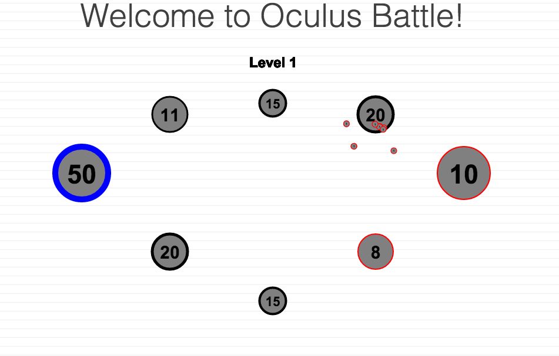
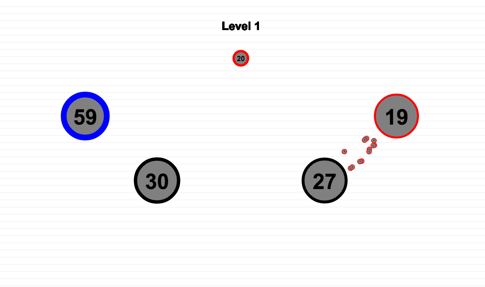
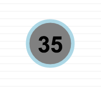
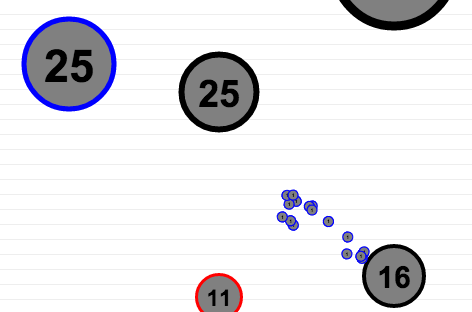

# JavaScript Game: [Oculus Battle!][description]

**[Check it out!][live-demo]**

[live-demo]: http://justfocus.github.io/oculusBattle/
[description]: http://justfocus.github.io/oculusBattle/


# Game Details
### Bases

- Except for the “home” locations, base locations are randomly generated each time the game is started or a new level begins.
	
	
- Randomly generated bases space themselves based on the number created and their size.
- Bases outline color changes upon selection.                     
	
- Base selection determined based on cursor location and location of bases.

### Units

- Units are spawned at random locations surrounding the base that created them.
- Upon spawning units calculate velocity vector to final target. Code below shows util function for vector calculations.
	
	```javascript
		var calcVec = Utils.calcVec = function (startPos, endPos, speed) {
			var xDist = (startPos[0] - endPos[0]);
			var yDist = (startPos[1] - endPos[1]);

			var theta = Math.atan(yDist / xDist);
			var xVel = speed * Math.cos(theta);
			var yVel = speed  * Math.sin(theta);
			if (startPos[0] > endPos[0]){ yVel *= -1; xVel *= -1;}
			return [xVel, yVel];
		};
	```
- Units have hitbox to check for collision with target

### AI
- The AI always attacks from it’s strongest base with greater than 15 units
- Waits approx. 1-2 seconds (varies) between each attack. Code below shows game function that calls ai methods. The function uses the rendering timer change to determine when to have the ai attack.
```javascript
	Game.prototype.aiMove = function (delta) {
		this.timer += delta;
		this.aiTimer += delta;
		if (this.aiTimer > (Math.random() * 4000 + 1600)) {
			var aiSelection =  this.ai.selectBase(this.bases);
			var aiAttack = this.ai.attackBase(this.bases, aiSelection);
			this.aiTimer = 0;
			if (aiSelection && aiAttack) {
				aiSelection.spawnUnits(aiAttack);
			}
		}
	};`
```
- Determines which base to attack by using a valuation equation that scales each base value by a random amount. Method below shows the logic for determining which base to attack.
```javascript
	AI.prototype.attackBase = function (bases, selectedBase) {
		var shuffledBases = this.FYShuffle(bases);
		if (selectedBase.value < 15) return undefined;
		for (var i = 0; i < bases.length; i++) {
			if (shuffledBases[i].team !== 'cpu'
				&& (selectedBase.value * (Math.random() + 0.33 )) > shuffledBases[i].value) {
				return shuffledBases[i];
			}
		}
		return undefined;
	};
```
-	The AI's bases generate units faster as the levels progress.


# Instructions

Oculus battle is a simplified RTS. The goal is to eliminate the enemy! You are the blue team and start on the left side of the map. The red team is the enemy and is controlled by the computer. The black team is neutral and cannot attack or generate units.

### Playing the Game:

You and your enemy both start with one base. Bases controlled by red or blue automatically generate units depending on their initial size. Bases can be selected with a mouse click. Once a base is selected you can then click another base to attack. Attacking sends half of a base's units to the second base clicked. You can also use this to reinforce your own bases. When a base goes below zero units it is taken over by the attacking team. A base's maximum size is twice its starting value.

**Recap:**
- Bases generate units over time based on starting size.
- Select a base by left clicking on it.
- Attack a base by first selecting a base you own then clicking another base.
- You can send units from bases you own to other bases you own.
- When you take over a base it will begin generating units for you.
